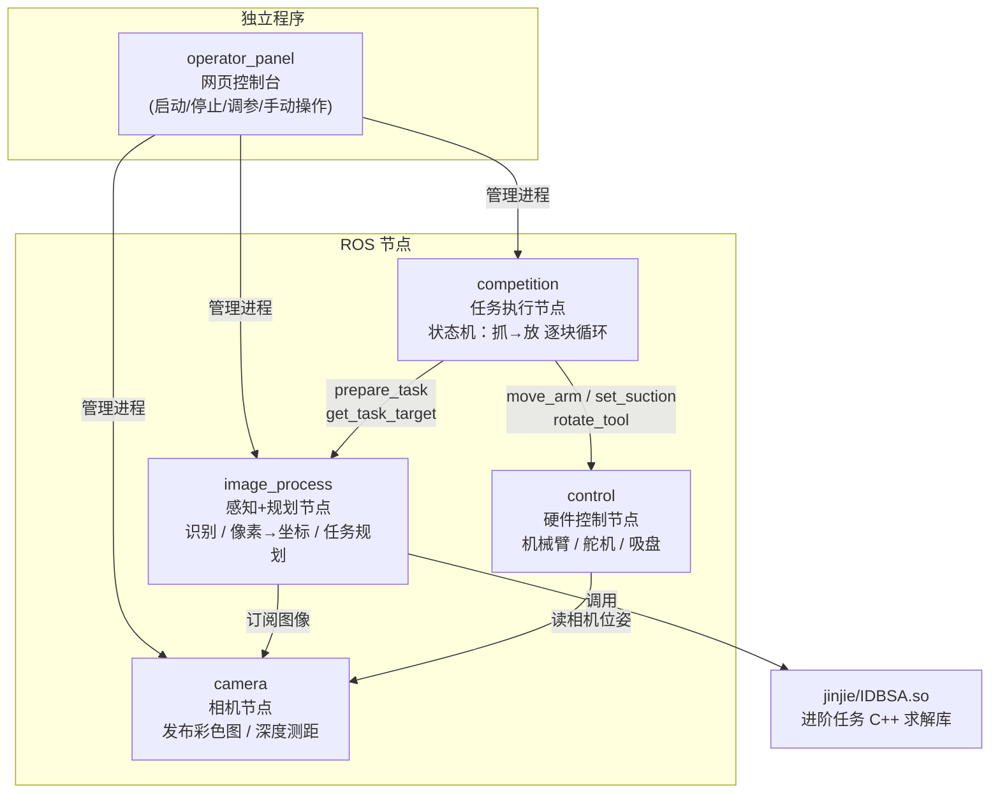
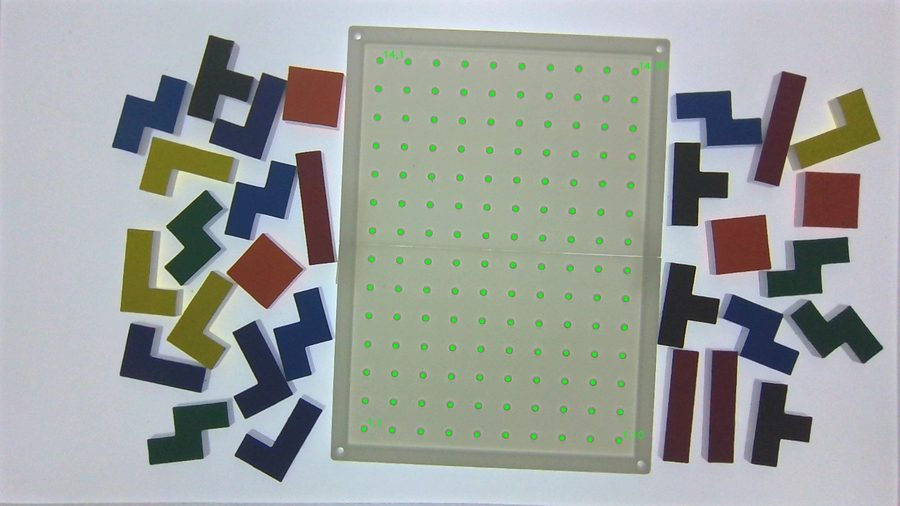
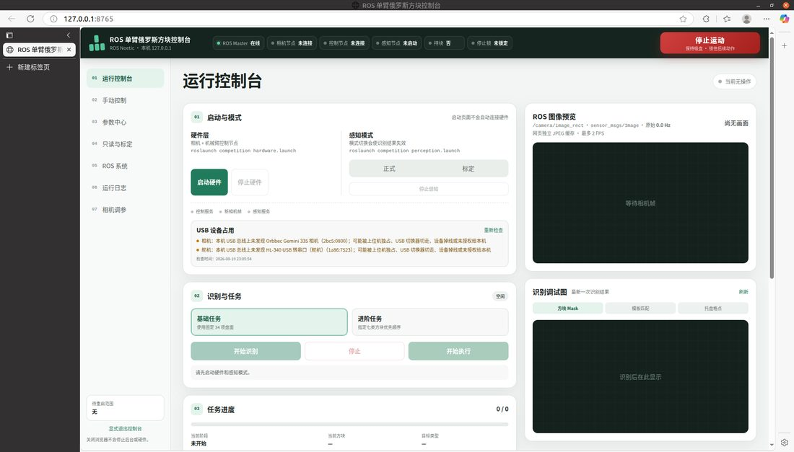

# 单臂俄罗斯方块 SingleArmTetris

一台机械臂，自己"看"桌上的彩色俄罗斯方块和托盘，自己"想"怎么摆能消行，然后一个一个抓起来摆进去——全程没有人操作。

---

## 一、整体思路：机器人玩俄罗斯方块，到底要解决哪几件事？

把问题拆开，其实就四个：

| 问题 | 通俗说法 | 由谁负责 |
|------|---------|---------|
| **看** | 桌上有哪些方块？什么形状、什么颜色、在哪？托盘的格子在哪？ | `image_process`（感知） |
| **想** | 每个方块放到哪个格子？按什么顺序摆走的路最短？ | `image_process`（规划）+ `jinjie`（进阶任务求解） |
| **动** | 怎么把机械臂准确地移动到方块上方、吸起来、再准确放进格子？ | `competition`（任务执行）+ `control`（硬件控制） |
| **看得准** | 相机看到的位置和真实位置总有小误差，怎么把它压下去？ | 标定映射（视觉伺服备用） |

**一次完整任务的时间线**是这样的：

```
机械臂抬到高位拍照
    ↓
识别：7 种彩色方块 + 托盘 14×10 格点
    ↓
规划：方块怎么分配、按什么顺序摆（基础/进阶两种算法）
    ↓
对每一个方块循环：
    移到方块上方 → 下降 → 吸住 → 抬起
    → 舵机把方块转到需要的角度
    → 移到目标格子上方 → 下降 → 吹气放下 → 抬起
    ↓
全部摆完，任务结束
```

正式比赛采用开环执行（为什么、以及备用的视觉伺服是怎么回事，见第四节）。

---

## 二、硬件组成

| 设备 | 作用 | 
|------|------|
| 法奥机械臂 | 负责所有运动 | 
| Orbbec Gemini 335 深度相机 | 装在机械臂手腕上，拍彩色图 + 深度图 |
| 电动吸盘（末端） | 吸住/吹气放开方块 |
| 旋转舵机（末端） | 带着吸盘旋转，调整方块的摆放角度 | 
| 14×10 格托盘 + 彩色方块 | 托盘格子就是"坐标系"，摆放目标都是格点 |

---

## 三、软件架构：分层解耦，一个包只管一摊

整个系统是 **4 个独立运行的 ROS 节点 + 1 个网页控制台 + 1 个算法库**。节点之间不互相 import 代码，只通过 **ROS 服务**通信：`competition` 调 `/control/move_arm` 说"帮我把手移到这个坐标"，`control` 干完活回一句"好了"。



### camera —— 相机功能包
只做一件事：把 Gemini 335 的彩色图发布出来（`/camera/image_rect`，已经做了去畸变），另外提供深度相关的服务（比如"这个点离桌面多高，世界坐标大概是多少"），主要给标定用。**它不做任何识别**，识别是别人的事。

### control —— 硬件调用功能包
把三种硬件各封装成一个 ROS 服务：
- `/control/move_arm`：直线运动到指定坐标（内部会做停稳判定、Z 高度安全检查——低于下限直接拒绝，防止撞桌面）
- `/control/rotate_tool`：舵机转到指定角度
- `/control/set_suction`：吸盘吸气 / 吹气 / 关闭

机械臂底层走厂商 SDK（XML-RPC 连机器人控制器），舵机走串口。**其他节点只跟这三个服务打交道，不关心硬件细节。**

### image_process —— 处理图像获得运动控制所需信息
全项目技术含量最密集的包。两大职责：

1. **识别**（"看到了什么"）：链路是 YOLO 检测方块和托盘 → 对方块 ROI 提取上表面 → 模版匹配精确计算方块位置和旋转角 → 托盘逐个定位 14×10=140 个格点位置。其中"上表面提取"有两代平行实现：**V1** 用 YOLO-seg 分割，**V2** 把这一步换成 Canny 边缘提取、不再需要分割模型。比赛临近故未放弃能跑的老链路，两代以平行方式共存，由参数一键切换，正式比赛用的是 V2。识别效果如下——左边方块上标出类别和置信度，右边托盘上逐格标出绿点：

   | 高位方块识别（类别 + 置信度） | 托盘格点粗定位（14×10 格点） |
   |:---:|:---:|
   |  |  |

2. **规划**（"接下来怎么摆"）：
   - **基础任务**：离线用求解器生成一个高分盘面库（`tools/找最优解`），线上根据实际识别到的方块组合，从库里挑最合适的盘面，再用匈牙利算法做方块→格子分配、束搜索优化摆放顺序（总路程尽量短，省时间）。
   - **进阶任务**：调 `jinjie` 里的 IDBSA 算法（C++ 写的、OpenMP 并行的搜索），在所有摆法里找总移动距离最短的方案。

### competition —— 比赛总指挥
一个任务状态机：`准备 → (对每个方块： 移动到位 → 抓取 → 旋转 → 摆放) → 结束`。它按规划结果逐块调用感知和硬件服务，把整个流程跑完。抓放每一步的速度、高度、安全限制都在 `competition/config/execution.yaml` 里调。**想知道"机器人每次抓取到底干了什么"，读这个包的 `task_runner.py` 就够了，它是全项目的流程主线。**

### operator_panel —— 网页控制台
一个 Flask 网页（跑起来自动弹浏览器）。比赛现场不敲命令行，所有操作都在网页上点：启动/停止各节点、开始/暂停/中止任务、手动动机械臂、吸吹测试、舵机点动、在线改配置、看日志、相机调曝光。人工干预（比如识别错了让人确认一下）也走这个页面。

<p align="center">
  
</p>

### jinjie —— 进阶任务求解器
不是 ROS 包，就是一份 C++ 源码（`IDBS_PlanA_OpenMP.cpp`）和编译好的 `.so` 库。核心思路：使用迭代加深的束搜索 + 多核并行，在 14×10 盘面上搜"把这批方块摆完、总移动距离最短"的方案。想深入看 `IDBSwithDistance.ipynb`，那是可读性最好的原型。

### tools —— 工具箱（正式运行不加载）
按用途分四类：
- `tools/vision/`：视觉标定与分析（九点标定、像素→TCP 标定分析、现场自检……）
- `tools/hardware/`：硬件单项测试（单独测舵机/吸盘/机械臂）
- `tools/找最优解/`：离线跑高分盘面库
- `tools/*_editor*/`：三个手工修正 GUI（识别错了用鼠标改）

注意：这些脚本**不用命令行传参**，参数都写在文件开头，用之前打开文件改参数再运行。

---

## 四、关键概念


### 1. 像素坐标 → 机械臂坐标转换算式的标定

相机拍到的是一张图：方块在"第 320 个像素、第 240 个像素"的位置。但机械臂要的是"往基座坐标系 X=350mm、Y=-20mm 处伸"。**像素和毫米是两套语言**，中间必须有个翻译。

这个翻译没法从理论上精确推出来（相机装到手上就有安装误差、镜头有畸变），所以用**实验拟合**：让机械臂走到工作区里一大堆已知位置，每个位置记下"相机看到的像素"和"机械臂真实坐标"这两组数，拟合出一个映射模型。这就是仓库里那些 `*_pixel_to_tcp_calibration*.yaml` 文件的来历。

**推论：场地一动、相机一碰、机械臂一挪，标定就可能失效**，需要重新采集（见第六节）。这是本项目运维中最高频的事。

### 2. 视觉伺服：为简化标定而生，因速度退役

早期最大的痛点不是识别，而是标定：9 点人工标定把吸盘位置、桌面位置等一堆容易变的因素糅在一起，场地碰一下就作废，重标时肉眼对准 9 个点繁琐耗时，出了误差也分不清是不是人工标定不准导致的，反复进行人工标定费力不讨好。伺服方案把这个过程简化成了"1点标定"：粗定位走到差不多 → 视觉伺服把目标修到相机正中心 → 执行一个固定的"相机中心→吸盘中心"偏移。人工只需要标这一个偏移，物理意义明确、结果可验证；而且正上方观察没有侧面干扰、空间分辨率更高。

它的代价是多轮"拍照—微调"，速度太慢。正式比赛还是采用了**开环**：按标定结果直接执行。伺服没有删掉，标定采集模式内部仍在用它对准采样点（见第六节）。

两段伺服调试实录（近距离观察 → 对准 → 执行的完整过程）：

方块视觉伺服：

https://github.com/user-attachments/assets/d00b9395-c7eb-4a4d-bf06-9cd7acb7cfd8

托盘视觉伺服：

https://github.com/user-attachments/assets/2d8a8d06-06ca-4321-bb89-7b5ea0dadd52

**已知遗留问题**：实验结果显示：开环用的偏置在工作区不同区域并不相同——比赛时用左中右分区偏置打了个粗糙的补丁，根因未查清。怀疑方向：相机不完全垂直桌面，偏置随深度 Z 变化；以及机械臂不同区域 TCP 读数与真实物理位置并非理想线性。**像素→TCP 转换是本项目最值得重新设计的一环。**

---

## 五、怎么跑起来

### 环境要求

- Ubuntu 20.04 + ROS Noetic（catkin 工作区）
- Python 虚拟环境（本机在 `/home/zhl/fr3env/fr3env`，换机器自己建一个，依赖装在 venv 里）
- TensorRT（只有识别 V1 的 `best_seg.engine` 用到，且只能在生成它的那张 GPU 上用，换机器要用 `.pt` 重新导出；跑 V2 不需要）

### ⚠️ 先确认这三样东西

1. **YOLO 模型路径**。`competition/model/` 下需要 `best5.14.pt`（方块检测）、`best.pt`（托盘检测）；`best_seg.engine`（上表面分割）只有识别 V1 用，跑 V2 可以不带。
2. **手眼矩阵** `camera/config/T_wrist2camera.npy` 在仓库里，但它是**我们这台机械臂**的标定结果，换机器必须重标。
3. **设备**：舵机串口映射为 `/dev/servo_motor`（udev 规则或软链接），机械臂控制器 IP 在 `control/config/controller.yaml` 里改。

### 启动命令

```bash
# 方式一：命令行
roslaunch competition competition.launch    # 正式抓放（感知+执行）
roslaunch competition hardware.launch       # 只起相机+硬件（调试用）
roslaunch competition calibration.launch    # 标定采集模式

# 方式二：网页控制台（推荐，比赛现场都用它）
bash operator_panel/scripts/start_operator_panel.sh
# 会自动加载 ROS 环境并弹出浏览器，之后所有操作都在网页上点
# 注意：脚本里的工作区路径是写死的，换机器要改
```

### 跑测试

```bash
cd src
PYTHONPATH=competition:image_process:. /home/zhl/fr3env/fr3env/bin/python -m pytest -q
```

---

## 六、标定：换场地后必做的事

整套标定分两层，从里到外：

1. **手眼标定**：确定相机和机械臂手腕的相对安装关系（产出 `T_wrist2camera.npy`）。相机一动就要重做。
2. **像素→TCP 标定**：确定"像素 ↔ 机械臂坐标"的映射（产出 `image_process/config/` 下方块、托盘各一份 YAML）。场地一动就要重做。

标定流程概览：`roslaunch competition calibration.launch` 进入标定采集模式 → 机械臂自动把画面里的方块全部抓一遍、再到托盘格点上采样（全程低速、不吸气）→ 每个点自动记录"像素+坐标"写入 CSV → 用 `tools/vision/pixel_to_tcp_calibration_analysis.py` 一次性分析两份 CSV，所有质量门禁通过才生成新的标定 YAML → **人工低速验证几个点没问题后**，手动复制到 `image_process/config/` 部署。

---

## 七、项目心得：难点在软硬件协调，不在算法

回头看，这个项目最难、最让人崩溃的，不是找最优摆法（纯软件问题，错了改掉就行），也不是识别像素坐标（算法是成熟的），而是**软硬件的协调匹配**

- 软件假设桌面、机械臂坐标系、相机平面三者相互平行——实际上没有一个面真正平行，误差从这里漏进来；
- 软件假设舵机旋转只改变角度——实际上舵机轴偏离旋转中心，不同角度对应不同抓取点，而且舵机没有位置反馈，转没转到位只能靠时间估计；
- 软件假设机械臂指哪打哪——实际上它重复定位精度很好，但"实际到达的位置"和它报告的坐标之间，存在随工作空间变化的绝对偏差。

我们的应对大多不优雅——分区偏置、偏心补偿表、靠标定锁死下扎深度......最想传下去的经验就一句话：写软件时要考虑硬件的物理约束，基于理想模型的求解可能会产生比赛无法接受的误差。

